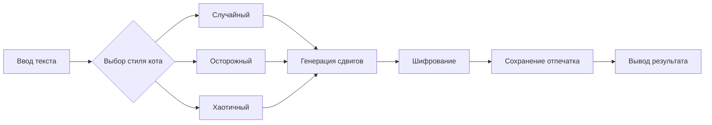

# CryptoCat-Shifter
Кот шифровальщик с разными стилями ходьбы! 
# 🐱 КриптоКот - Шифровальщик с характером

Кот, который шифрует сообщения разными стилями ходьбы и сохраняет отпечатки лап.

## ✨ Возможности
- 7 стилей шифрования (характеров кота)
- Сохранение "отпечатков лап" в JSON
- Простой API
- Работает на Python 3.6+

## 🚀 Быстрый старт

```python
from cryptocat import CryptoCats

# Создать кота
cat = CryptoCats(name="Мурзик", style="chaotic", seed=123)

# Зашифровать
text = "Секретное сообщение"
encrypted = cat.encrypt(text)
print(f"Шифр: {encrypted}")

# Расшифровать
decrypted = cat.decrypt(encrypted)
print(f"Текст: {decrypted}")Стиль Описание Сдвиги
random Случайный 1-9
careful Осторожный 1-3
chaotic Хаотичный 7-12
zigzag Зигзаг +3/-3
gallop Галоп 2,4,2,4,6
spiral Спираль 1→5→1
sleepy Сонный часто 0Структура проекта


Стиль Описание Сдвиги
random Случайный 1-9
careful Осторожный 1-3
chaotic Хаотичный 7-12
zigzag Зигзаг +3/-3
gallop Галоп 2,4,2,4,6
spiral Спираль 1→5→1
sleepy Сонный часто 0

кстати тут есть пасхалка
